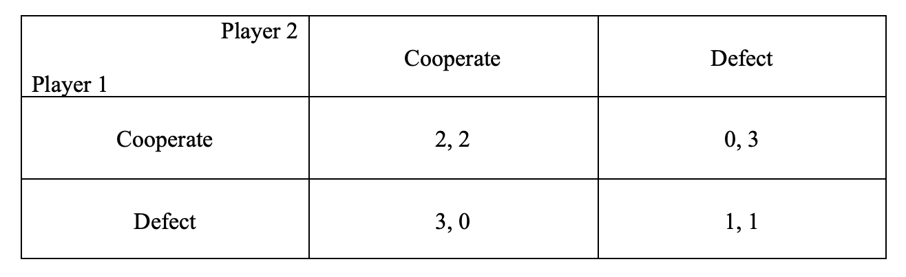

class: middle

```{r, child = '../setup.rmd', cache = FALSE}
```

```{r xaringan-scribble, echo=FALSE}
xaringanExtra::use_scribble()
```

```{r, include = F, cache = FALSE}
library(data.table)
library(ggplot2)
library(dplyr)
library(gganimate)
library(gifski)
library(gganimate)
# library(learnr)
```

```{r, include = F, eval=F, cache = FALSE}
httpgd::hgd()
httpgd::hgd_browse()
```

```{r xaringan-tachyons, echo=FALSE}
xaringanExtra::use_tachyons()
```


<!-- .content-box-green[**A Useful tip:**]

hitting letter "o" key will give you a panel view of the slides -->

<!-- ---
class: middle -->

# The Basics

+ Assignment
  * Five assignments in total
  * Submit your work on Canvas by Tuesday 3:00 pm
 
+ My office hours
  * at Waite Library
  * Thursday 2 - 2:50 pm
  * Friday 2 - 2:50 pm (need to be changed)
  * Or feel free to shoot me an email to set up a time for a meeting (Zoom or in person)

???
+ Alright, let's get started. 
+ My name is Shunkei Kakimoto, I am a TA for next two Micro courses, Game theory and Welfare Economics. 
+ I know you guys and you know me, so please don't hesitate reach out to me. I am happy to help with whatever I can.  
+ Feel free to ask questions to me via email or in-person or whatever. 

+ About assignment, there are five assignments in total through this course, and please submit your assignment on Canvas by Tuesday 3 pm. 

+ I plan my office hours at 2-2:50 on Thursday and Friday at Waite Library, but I found that my office hours on Friday overlap with the econometric recitation class (?).

+ To which date and time I should move my Friday office hour?
  + Steve, Monday 4-5pm, Wed 12-1pm
  + Monday 12 - 1 pm? Tuesday 2 - 3 pm (before Tuesday class), or Friday 1 - 2 pm? 

---
class: middle

# Outline

1. Dominant strategy equilibrium and Iterated strict dominance (Lecture note 2, p 13 - 16) (10 mins)
2. Exercise problem 1 (20 mins)
3. Exercise problem 2 (20 mins)

???
+ This is the outline for today's session. 
+ In this week's assignment, There are questions related to Dominant strategy equilibrium and Iterated strict dominance, which we didn't cover in this week lectures'. So, I'm gonna explain about these concepts. 
+ And, I prepared some exercise problems, which might be helpful for this week's assignment. So, let's do it. 

---

class: middle

# Dominant Strategy Equilibrium
<!-- .bg-washed-green.b--dark-green.ba.bw2.br3.shadow-2.ph2.mt2[

**Nash equilibrium**

At an equilibrium, each player's strategy is a best response to the others (or no player has a profitable deviation).
]  -->


Other than Nash equilibrium, there is another type of equilibrium called **dominant strategy equilibrium**, which could be used to make fairly compelling predictions about games. 

???
+ We learned about NE. NE is great in that it is widely applicable and used to make predictions about games. 
+ But there is another way of making predictions about the game with another equilibrium concept, called dominant strategy equilibrium. 

---
class: middle

# Definition

.bg-washed-green.b--dark-green.ba.bw2.br3.shadow-2.ph2.mt2[

1. <b>Dominant strategy</b>: for $s_i, t_i \in S_i$, 

(i) $s_i$ **weakly dominates** $t_i$ if $U_i(s_i, s_{\sim i}) \color{blue}{\ge} U_i(t_i, s_{\sim i})$ for all $s_{\sim i} \in S_{\sim i}$.

<!-- (ii) $s_i$ **dominates** $t_i$ if $U_i(s_i, s_{\sim i}) \color{blue}{\ge} U_i(t_i, s_{\sim i})$ for all $s_{\sim i} \in S_{\sim i}$ and $U_i(s_i, s_{\sim i}) \color{red}{>} U_i(t_i, s_{\sim i})$ for some $s_{\sim i} \in S_{\sim i}$. -->

(ii) $s_i$ **strictly dominates** $t_i$ if $U_i(s_i, s_{\sim i})\color{red}{>} U_i(t_i, s_{\sim i})$ for all $s_{\sim i} \in S_{\sim i}$.
]

???
+ Here are the definitions of dominant strategies. 
+ Suppose that $s_i$ and $t_i$ are the elements of individual $i$'s strategies. We say $s_i$ weakly dominates $t_i$ for player $i$, if, no matter what any other players do, playing $s_i$ gives at least as high payoff as playing $t_i$ for player $i$. 

---
class: middle

# Definition

.bg-washed-green.b--dark-green.ba.bw2.br3.shadow-2.ph2.mt2[

1.<b>Dominant strategy</b>: for $s_i, t_i \in S_i$, 

(i) $s_i$ **weakly dominates** $t_i$ if $U_i(s_i, s_{\sim i}) \color{blue}{\ge} U_i(t_i, s_{\sim i})$ for all $s_{\sim i} \in S_{\sim i}$.

<!-- (ii) $s_i$ **dominates** $t_i$ if $U_i(s_i, s_{\sim i}) \color{blue}{\ge} U_i(t_i, s_{\sim i})$ for all $s_{\sim i} \in S_{\sim i}$ and $U_i(s_i, s_{\sim i}) \color{red}{>} U_i(t_i, s_{\sim i})$ for some $s_{\sim i} \in S_{\sim i}$. -->

(ii) $s_i$ **strictly dominates** $t_i$ if $U_i(s_i, s_{\sim i})\color{red}{>} U_i(t_i, s_{\sim i})$ for all $s_{\sim i} \in S_{\sim i}$.
]

<br>

.bg-washed-green.b--dark-green.ba.bw2.br3.shadow-2.ph2.mt2[

2.<b>Dominant strategy equilibrium</b>: 

$s \in S$ is a (weekly/strictly) **dominant strategy equilibrium** if for all $i \in N$, and all $t_i \in S_i$, $s_i$ (weekly/strictly) dominates $t_i$. 
]

???

+ With these definitions, dominant strategy equilibrium are are defined such that if weakly or strictly dominant strategy $s_i$ exists for each player, then players, fo course, their dominant strategy. Then, the equilibrium is called dominant strategy equilibrium.

---
class: middle

## Example: Prisoner's Dilemma

```{r  echo = F, out.width = "80%"}

```

.content-box-green[**Question**]

Is there any (weekly/strictly) dominant strategy for each player? Can you find a dominant equilibrium?

???
+ Let's see these concepts with an example of Prisoner's Dilemma.
+ Can you find a dominant strategy for each player? Let's do this together. Can you fid 
+ Let's start with player 1. When player 2 plays "Cooperate",  Player 1 should play defect. When player 2 plays "Defect", Player 1 should plays Defect. Therefore, "Defect" is the strictly dominant strategy for player 1. 
+ In the same way, we can see that "Defect" is the strictly dominant strategy for player 2. 
+ Therefore, (Defect, Defect) is a strictly dominant strategy equilibrium. 

---
class: middle

.content-box-green[**Nash equilibrium v.s. Dominant equilibrium**]

+ For a Nash equilibrium, each player needs to predict what the opponent's optimal strategy is. 
+ For a dominant equilibrium, each player only cares about their optimal strategies and doesn't care what the opponent's best strategy is. 

<br>

.content-box-green[**NOTE**]

In many games, however, one or more players do not have dominant strategies. In that case, we cannot derive an equilibrium using the dominant strategies approach...

???
+ What's the difference between Nash equilibrium and dominant strategy equilibrium?
+ The major difference is that while Nash equilibrium requires for each player to figure out what the opponent's optimal strategy is, the opponent's optimal strategy does not matter for dominant strategy equilibrium. 
+ For dominant strategy, each players only cares about their payoffs, and plays the best strategy that gives higher payoff no matter how the opponent plays. 

+ The weak point of dominant strategies approach is that if both players do not have dominant strategies, we cannot derive an equilibrium.

+ But there is a solution concept to solve the game using the information about strictly dominated strategy, which is called There is a process called iterated strict dominance. 


+ All dominant strategy equilibria are Nash equilibria, the reverse is not true.
  + This is intuitive as some games cannot be solved with dominant strategies approach.  

---
class: middle

# Iterated Strict Dominance

.content-box-green[**Idea:**]

A rational player always plays the dominant strategy (if it exists) no matter what the opponents might do. 

In other words, <span style="color:blue">no rational player should ever play a strictly dominated strategy.</span> 

<br>

.content-box-green[**Procedure**]

Repeat to eliminate strictly dominated strategies. 

???
+ Iterated strict dominance can be regarded as **a refinement of the dominant strategies approach** which we saw in the previous slides. 

+ The idea behind this concept is that a rational player always plays the dominant strategy (if it exists) no matter what the opponents might do. 
+ In other words, no rational player should play a strictly dominated strategy. Right? Pretty intuitive. 
+ Don't get confused with strictly dominant strategy and strictly dominated strategy. 
  + Say, if A is strictly dominant strategy, that means strategy A is the best strategy that gives higher payoff than playing any other strategies, no matter how the opponent plays.
  + Meanwhile, if A is strictly dominated, that means some other strategy exists, say B, that strictly dominates A. 


+ Making use of this idea, iterated strict dominance let us predict the outcome of a game. 
+ The procedure is pretty simple. All we need to do is to repeat to find a eliminated strictly and to eliminate such a strategy. The survived pair of the strategy is the outcome. 

+ Let's see an example.

---
class: middle
## Example

This is the game you did in the class this Wednesday. 

```{r  echo = F, out.width = "120%"}
knitr::include_graphics("photos/photo2_1.png")
```

.content-box-green[**Question**]

+ Is there any strictly dominant strategy for each player? (Recall that strictly dominant strategy is the best strategy no matter what the opponent may play.)

+ Is there any <span style="color:blue">strictly dominated strategy</span>?

---
class: middle
## Example

This is the game you did as an in-class game in this Wednesday. 

```{r  echo = F, out.width = "120%"}
knitr::include_graphics("photos/photo2_1.png")
```

.content-box-green[**Question**]

+ Is there any strictly dominant strategy for each player? (Recall that strictly dominant strategies is the best strategy no matter what the opponent may play.)

<span style="color:blue">No.</span>

+ Is there any <span style="color:blue">strictly dominated strategy</span>?

<span style="color:blue">Yes!</span>

???
+ There are no strictly dominant strategies in this game. 

---
class: middle

```{r  echo = F, out.width = "120%"}
knitr::include_graphics("photos/photo2_1.png")
```

But there is a strictly dominated strategy. 

<br>

No matter what Player 1 may play, Player 2 always gets a higher payoff from Playing R than from Playing C. 

&rarr; Because <span style="color:blue">C is strictly dominated by R for player 2</span>, a rational player 2 will not play C. 

&rarr; If player 1 knows that player 2 is rational then player 1 can eliminate the possibility that player 2 plays C. 

???
+ This slide summarizes what I've just said. 
+ Since C is strictly dominated by R for palyer 2, a rational player 2 will not play C. 
+ From the standpoint of player 1, if player 1 knows that player 2 is rational, then player 1 will eliminate the possibility that player 2 will not play C. 

---
class: middle

Now the games looks like this. 

```{r  echo = F, out.width = "120%"}
knitr::include_graphics("photos/photo2_2.png")
```

.content-box-green[**Question**]

Is there any strictly dominated strategy?

???
+ After eliminated player 2's strategy $C$, now the game looks like this. 
+ Can we eliminate other strategies for player 1 or 2 in the same way?

---
class: middle

```{r  echo = F, out.width = "120%"}
knitr::include_graphics("photos/photo2_2.png")
```

No matter what player 2 plays, player 1 gets a higher payoff from playing U than from playing M or D. 

&rarr; Because <span style="color:blue">M and D are strictly dominated by U for player 1</span>, a rational player 1 will not play M and D. 

&rarr; If player 2 knows that player 1 is rational then player 2 can eliminate the possibility that player 1 plays M or D. 

???
+ No strictly dominated strategies for player 2. 
+ But, for player 1, M and D are strictly dominated by U. 

---
class: middle

Now the game looks like this. 

```{r  echo = F, out.width = "120%"}
knitr::include_graphics("photos/photo2_3.png")
```

<span style="color:blue">For palyer 2, R is strictly dominated by L.</span>

Thus, iterated strict dominance predicts $(s_1, s_2)=(U, L)$.

???
+ The table is further narrowed down, and we can easily see that R is strictly dominated by L for player 2. 
+ As a result, iterated strict dominance finds that (U, L) is the outcome of this game. 

---
class: middle

.content-box-green[**NOTE:**]

If there are no strictly dominated strategies to be eliminated (i.e. all the strategies in the game survive), iterated strict dominance fails to yield a prediction. 

???
+ Of course, there is a limitation when using iterated strict dominance. That is, if there are no strictly dominated strategies to be eliminated (i.e. all the strategies in the game survive), iterated strict dominance fails to yield a prediction. 

---
class: middle

.content-box-green[**Nash equilibrium v.s. Iterated strict dominance**]

Gibbsons P.7-8

> Nash equilibrium is a stronger solution concept than iterated elimination of strictly dominated strategies, in the sense that the player' strategies in a Nash equilibrium always survive iterated elimination of strictly dominated strategies, but the converse is not true. 


???
+ That's it for dominant strategy and iterated strict dominance. I hope this will be helpful for the assignment. 

---
class: middle

# Example Problem 1 (Discrete strategies):

Bob and Ray are driving in opposite directions down a road that narrows down to a single lane to cross a river.  Each player can either maintain speed (M) or slow down (S). Players choose their strategy simultaneously one time (static game of complete information). If both players maintain speed they will crash on the bridge and each get a payoff of -8.  If one player maintains speed and the other slows down the player maintaining speed gets a payoff of 3 while the other player gets a payoff of 0.  If both players slow down, they each get a payoff of 1.  

(1) Write down the strategy set of each player.

(2) Write down the normal form for this game.

(3) Find **all** Nash equilibria for this game. 

???
+ There are three points to understand the game , which are (i) the players in the game, (ii) strategy available to each player, and (iii) the payoffs received by each player.
  + the normal-form representation of a game summaries these points. 
  + normal-form representation can be mainly used for static game, but it can be also used for sequential-move games (but in that case, the extensive-form representation of the game is more convenient framework for analyzing dynamic issues.)
+ Once you understand the game, the rest of the process is mechanical (always the same pattern).
---
class: middle

# Example Problem 2 (Continuous strategies):

Two players are deciding how to split $1. They simultaneously put in a bid for how much of the dollar they will receive, $s_i$, $i = 1, 2$.  If the sum of the bids is less than or equal to $1 then each player receives their bid. If the sum of the bids is more than $1 then both players receive a payoff of 0. 

(1) Write down the payoff function for each player as a function of strategies.

(2) Find the best response function for each player.

(3) Find all pure strategy Nash equilibria for this game.  


