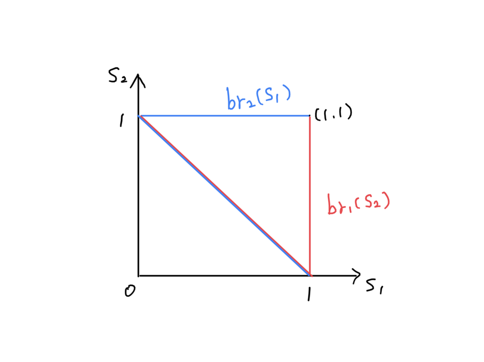

```{r setup, include=FALSE}
# library(knitr)
# library(here)

# here::i_am("")

# opts_knit$set(root.dir = "")
# opts_knit$set(root.dir = here())

knitr::opts_chunk$set(
  echo = FALSE,
  # cache = FALSE,
  # comment = NA,
  message = FALSE,
  warning = FALSE
  # tidy = FALSE,
  # cache.lazy = FALSE
  #--- figure ---#
  # dpi = 400,
  # fig.width = 7.5,
  # fig.height = 5,
  # out.width = "750px",
  # out.height = "500px"
)
```

# Example Problem 2 (Continuous strategies):

Two players are deciding how to split $1. They simultaneously put in a bid for how much of the dollar they will receive, $s_i$, $i = 1, 2$.  If the sum of the bids is less than or equal to $1 then each player receives their bid. If the sum of the bids is more than $1 then both players receive a payoff of 0. 

(1) Write down the payoff function for each player as a function of strategies.

(2) Find the best response function for each player.

(3) Find all pure strategy Nash equilibria for this game.  


\

\


\textbf{\textcolor{blue}{Solutions}}

A set of strategies for Player i ($i=\{1,2\}$) is $S_i \in [0,1]$. Let $s_i \in S_i$. 

## Part (1)
Let $v_i$ denote player i's payoff function ($i=\{1,2\}$). Then, 
\begin{equation*}
  v_i =
    \begin{cases}
      s_i & \text{if $s_i + s_{-i} \leq 1$}\\
      0 & \text{if $s_i + s_{-i} > 1$}\\
    \end{cases}       
\end{equation*}

## Part (2)

Let $br_i(s_{-i})$ denote player i's best response correspondence to the opponent's strategy $s_{-i}$ ($i=\{1,2\}$). If Player i-1 picks $s_{-i}$, player i's best response is $1-s_{-i}$. Specifically if player i-1 picks $s_{-i}$=1, player i's best response is $1-s_{-i}=1-1=0$, which makes player 1's choice indifferent among $s_i \in [0,1]$. Thus, i's player's ($i=\{1,2\}$) best response correspondence can be summarized as follows: 
\begin{align*}
br_i(s_{-i}) =
  \begin{cases}
      1 - s_{-i} & \text{if $s_{-i} < 1$}\\
      [0,1] & \text{if $s_{-i} = 1$}\\
  \end{cases} 
\end{align*}


## Part (3)
The graph below shows the best response correspondences for player 1 and player 2. The Nash equilibria are the intersections of the  player 1's and player 2's best response correspondences, which are the points on the line $s_1+s_2=1$ and the point $(1,1)$. Thus, the Nash equilibria for this game are $(s_1, s_2)$ satisfying $s_1+s_2=1$ ($s_1, s_2 \in [0,1]$) and $(s_1, s_2)=(1,1)$.

```{r, out.width = '80%'}

```
