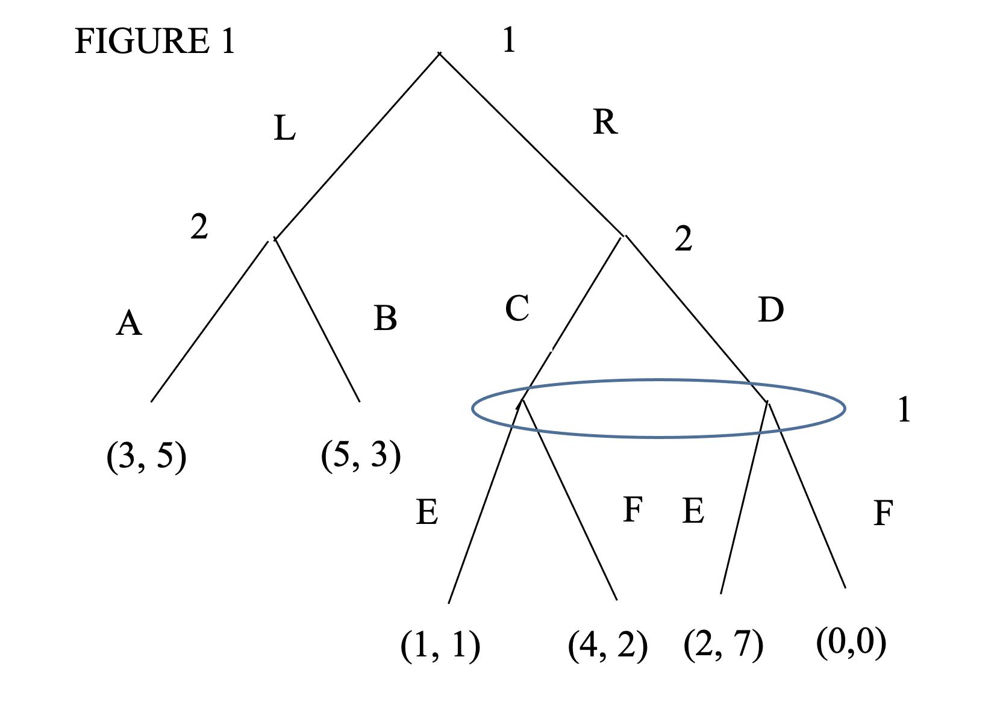

class: middle

```{r, child = '../setup.rmd', cache = FALSE}
```

```{r xaringan-scribble, echo=FALSE}
xaringanExtra::use_scribble()
```

```{r, include = F, cache = FALSE}
library(data.table)
library(ggplot2)
library(dplyr)
library(gganimate)
library(gifski)
library(gganimate)
# library(learnr)
```

```{r, include = F, eval=F, cache = FALSE}
httpgd::hgd()
httpgd::hgd_browse()
```

```{r xaringan-tachyons, echo=FALSE}
xaringanExtra::use_tachyons()
```

# Quick review

.content-box-green[**Dynamic game**]

Players  move sequentially or repeatedly. 


.bg-washed-green.b--dark-green.ba.bw2.br3.shadow-2.ph2.mt2[ 

<b>Subgame Perfect Nash Equilibrium</b>

Definition: A set of strategies is a subgame Nash equilibrium if it is a Nash equilibirium in all subgames.
]


---
class: middle

# Exercise Problem 1 (Midterm 2020)

Consider the extensive form game in Figure 1.  The first payoff in parentheses is player 1’s, while the second is player 2’s.  

(a).  Write down the strategies for each player.

(b).  Find all Nash equilibria for the subgame starting with player 2 after player 1 has chosen $R$. 

(c).  Write down the normal form version of this game.

(d).  What are the pure strategy Nash equilibria for the complete game?

**(e)**.  What are the pure strategy subgame perfect Nash equilibria for the complete game?

```{r  echo = F, out.width = "50%"}

```


---
class: middle

# Exercise Problem 2 (Midterm 2020)

Three firms compete as Cournot oligopolists. Let $q_i$ be the quantity produced by firm $i$, $i = 1, 2, 3$. The market inverse demand curve is given by $P(Q)=30-Q$, where $P$ is market price and $Q$ is quantity, with $Q=\sum_{i=1}^3 q_i$. Each firm has a cost function given by: $C(q_i)=6q_i$. 

(a). Solve for the Cournot equilibrium. Solve for the profit made by each firm in Cournot equilibrium.

(b). Suppose the firms collude to maximize joint profits and share profit equally by each producing $1/3$ of the monopoly output. How much does each firm produce? What is the profit of each firm?

(c). Suppose the three firms compete in an infinitely repeated game. Suppose that $\delta$ is the discount factor between each stage of the repeated game. For what values of $\delta$ is it possible to support the collusive outcome as a subgame perfect Nash equilibrium of the infinitely repeated game?


