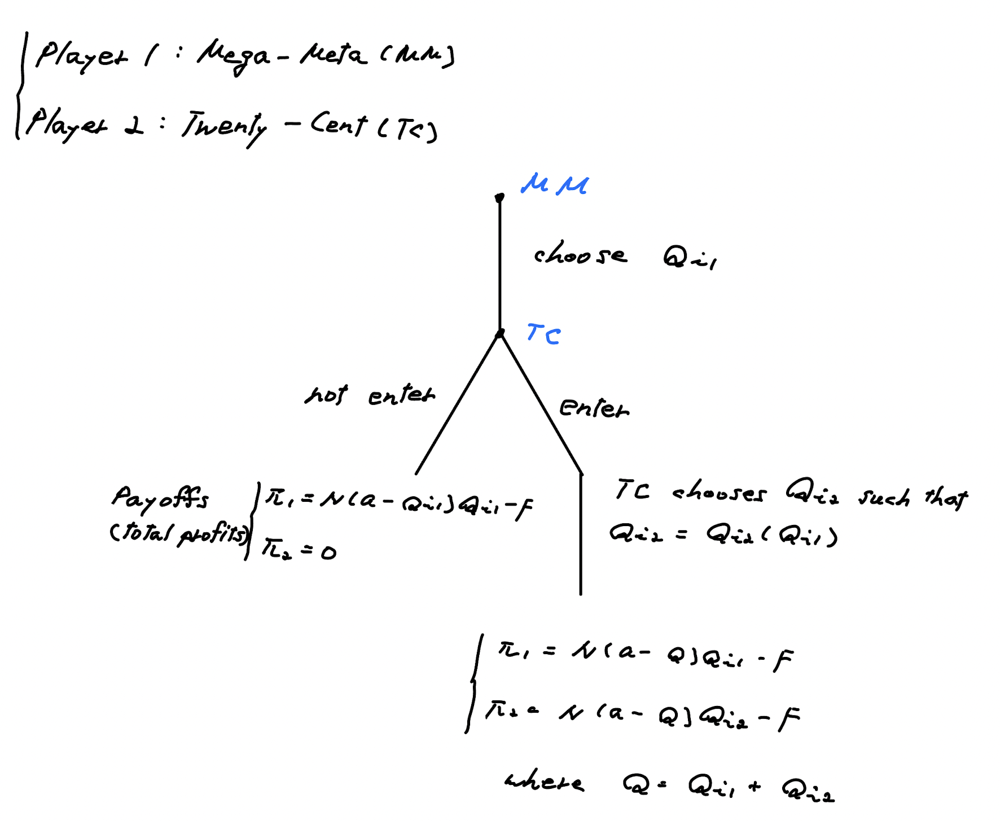

```{r setup, include=FALSE}
# library(knitr)
# library(here)

# here::i_am("")

# opts_knit$set(root.dir = "")
# opts_knit$set(root.dir = here())

knitr::opts_chunk$set(
  echo = FALSE,
  # cache = FALSE,
  # comment = NA,
  message = FALSE,
  warning = FALSE
  # tidy = FALSE,
  # cache.lazy = FALSE
  #--- figure ---#
  # dpi = 400,
  # fig.width = 7.5,
  # fig.height = 5,
  # out.width = "750px",
  # out.height = "500px"
)
```

# Problem 3, Midterm Spring 2023

The Mega-Meta Corporation is a monopolist in the production of game theory software. There are $N$ consumers of this software, $i = 1, 2, ..., N$. Each consumer $i$ has an inverse demand curve: $P_i (Q_i )=a-Q_i$, where $P_i$ is the price to consumer $i$, and $Q_i$ is quantity sold to consumer $i$. Assume there is a fixed cost, $F$, to develop the software, but no cost for distributing the software (zero marginal cost). The cost function for Mega-Meta is: $C(Q)=F$, where $Q=\sum_{i=1}^N Q_i$  (note: $C$ does not depend on $Q$ because marginal cost is zero). 

## Part (c)

Suppose that Mega-Meta faces potential competition from Twenty-Cent Inc. Assume that Mega-Meta moves first and chooses a quantity to produce for each consumer $(Q_{i1})$. Next, Twenty-Cent decides whether or not to enter. If it enters, it pays a fixed cost of $F$, and then it chooses a quantity to sell to each consumer $(Q_{i2})$. If it doesn’t enter, then Twenty-Cent earns a $0$ payoff and Mega-Meta remains a monopolist. 

(i) Suppose that Mega-Meta anticipates entry and produces as a Stackelberg leader and Twenty-Cent plays as a Stackelberg follower. What is the Stackelberg equilibrium?

(ii) How much would Mega-Meta need to sell to each consumer in order to convince Twenty-Cent not to enter? 

(iii) Suppose that a = 12, N = 100 , and F = 400. What is the subgame perfect equilibrium in this case?

\

\

\textbf{Solution is the next page }

\newpage

# Solutions

\textcolor{blue}{The official solution is available on Canvas}

### Part (c)
The (informal) extensive form for this game looks like this:

```{r, out.width = '80%'}

```


### Part (c)-i
First, consider the TC's problem:

\begin{equation*}
\begin{aligned}
\max_{Q_{i2}} \quad & \pi_{TC, i} = (a-Q_{i1}-Q_{i2})Q_{i2} - F
\end{aligned}
\end{equation*}

F.O.C. 
\begin{align*}
\frac{\partial \pi_{TC, i}}{\partial Q_{i2}} = 0 \iff Q_{i2} = \frac{a-Q_{i1}}{2}
\end{align*}
That is, TC's best response function for MM's $Q_{i1}$ is 
$$Q_{i2}(Q_{i1}) = \frac{a-Q_{i1}}{2} \quad \cdots (\ast)$$

\newpage 

Given the TC's best response function, MM's profit maximization problem is 

\begin{equation*}
\begin{aligned}
\max_{Q_{i1}} \quad \pi_{MM, i} &= \Bigl(a-Q_{i1}-Q_{i2}(Q_{i1})\Bigl)Q_{i2} - F \\
&= \Bigl(a-Q_{i1}-\frac{a-Q_{i1}}{2} \Bigl) - F \\
&= \frac{a-Q_{i1}}{2} - F
\end{aligned}
\end{equation*}
F.O.C. 
\begin{align*}
\frac{\partial \pi_{MM, i}}{\partial Q_{i1}} = 0 \iff Q_{i1}^{\ast} = \frac{a}{2}
\end{align*}
Substituting $Q_{i1}^{\ast} = \frac{a}{2}$ into the TC's best response function, we get 
$$Q_{i2}^{\ast} = \frac{a-Q_{i1}^{\ast}}{2}=\frac{a}{4}$$.

The Stackelberg equilibrium is:
$$Q_{i1}^{\ast} = \frac{a}{2}, \quad Q_{i2}^{\ast} = \frac{a}{4}$$.
At this equilibirium, MM earns $\Pi_{1}=N (a- \frac{a}{2} - \frac{a}{4} )\frac{a}{2} - F = N \cdot \frac{a^2}{8} - F$, and TC earns $\Pi_{2} = N (a- \frac{a}{2} - \frac{a}{4} )\frac{a}{4} - F = N \cdot \frac{a^2}{16} - F$.

### Part (c)-ii
When MM chooses $Q_{i1}$, TC chooses $Q_{i2}=Q_{i2}(Q_{i1})=\frac{a-Q_{i1}}{2}$ (see Equation $(\ast)$). Then, TC's total profit is 
\begin{align*}
\Pi_{TC} 
  &= N(a-Q_{i1}-Q_{i2}(Q_{i1})) - F \\
  &= N(a-Q_{i1}-\frac{a-Q_{i1}}{2}) - F \\
  &= N \Bigl(\frac{a-Q_{i1}}{2} \Bigl)^2 - F 
\end{align*}

If TC enters, TC earns $\Pi_{TC}=N \Bigl(\frac{a-Q_{i1}}{2} \Bigl)^2 - F$. If TC does not enter, TC's profit is zero. In order to make deter TC from entering, MM nees to choose $Q_{it}$ such that 
$$N \Bigl(\frac{a-Q_{i1}}{2} \Bigl)^2 - F \leq 0$$
or, 
$$Q_{i1} \leq a - 2 \sqrt{\frac{F}{N}}$$

### Part (c)-iii

\textcolor{blue}{Depending on MM's choice of $Q_{1t}$, MM can let TC enter or deter TC from entering into the industry. If MM lets TC enter the industry, MM and TC play Stackelberg competition. Meanwhile, MM can deter TC from entering by choosing $Q_{i1} \leq a - 2 \sqrt{\frac{F}{N}}$ as we found in part (ii). Ultimately, the choice of $Q_{i1}$ by MM depends on the profits MM can make for each case.}

(case I) Suppose that MM let YC enter the industry, and they play Stackelberg competion. From part (i), MM's profit is 
$$\Pi_1 = N \cdot \frac{a^2}{8} - F = 100 \cdot \frac{12^2}{8} - 400 = 1400$$.

(case II) Suppose that MM deter TC from entering by choosing $Q_{i1} \leq a - 2 \sqrt{\frac{F}{N}} = 12 - 2 \sqrt{400/100} = 8$. MM's profit is 
$$\Pi_1 = N(a - Q_{i1})Q_{i1} - F$$.
$\Pi_1$ is decreasing in $Q_{i1}$. Thus, when $Q_{i1}=8$, MM can get the highest payoff while detering firm 2 from entering into the industry. MM profit at $Q_{i1}=8$ is 
$$\Pi_1 = 100 \cdot (12 - 8) \cdot 8 - 400=2800$$, which is greater than the profit from playing Stackelberg competition. 

The SPNE is such that $\{Q_{i1}=8; not entering, Q_{i2}(Q_{i1}) = \frac{a-Q_{i1}}{2} \text{ with entry}\}$. 

(\textcolor{blue}{NOTE: Be careful in answering SPNE! You need to specify players’ strategy at all nodes, not just nodes on the equilibrium path. (e.g., What should TC do when entering? What should TC do when not entering?)})


