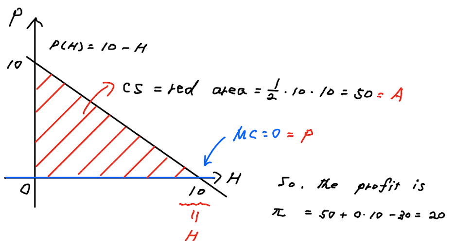
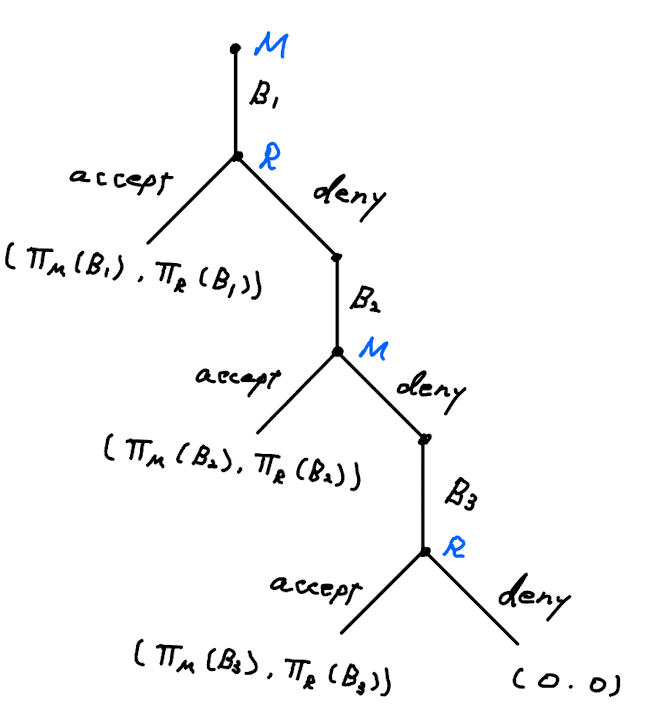
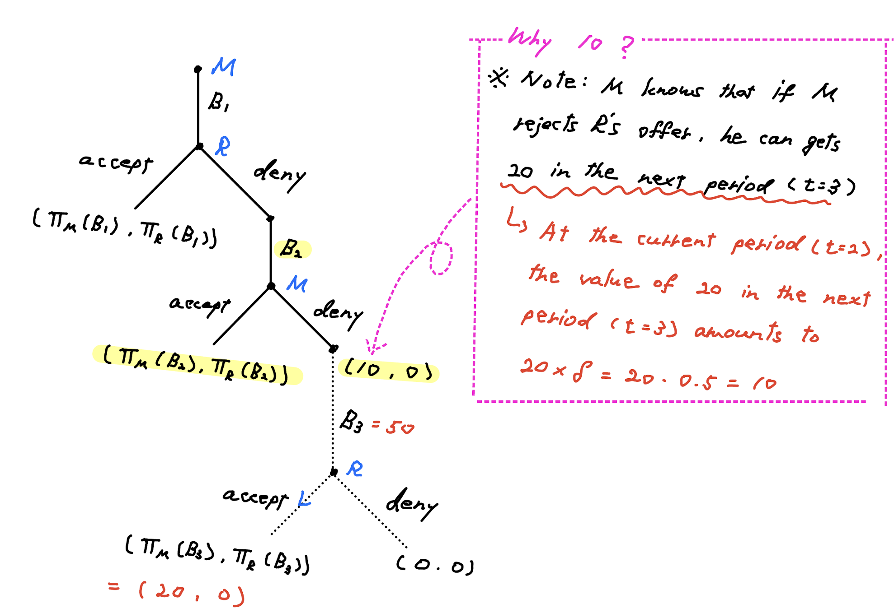
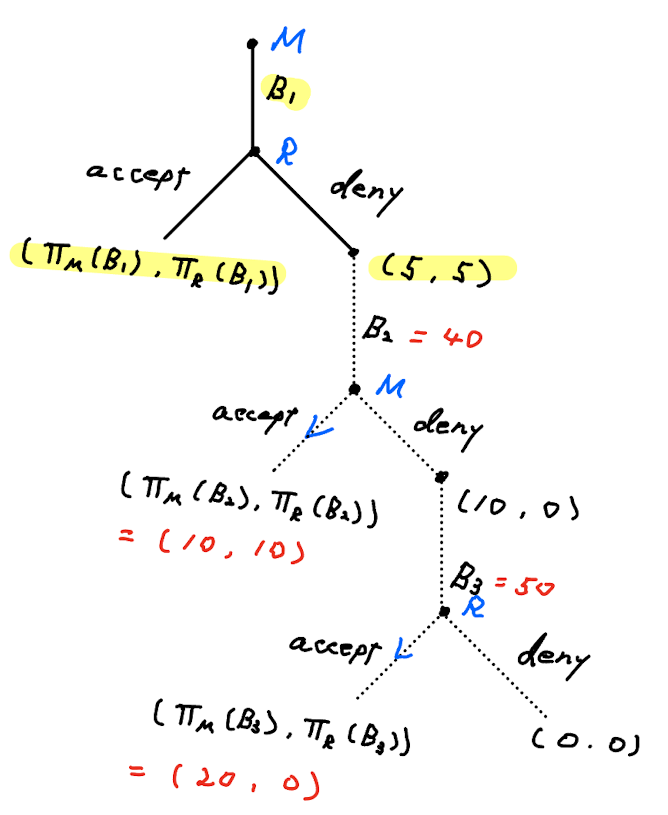
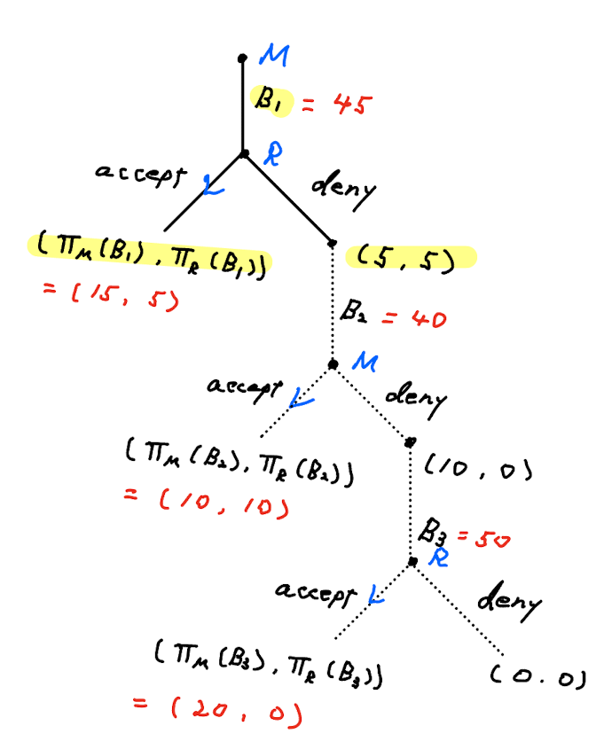

class: middle

```{r, child = '../setup.rmd', cache = FALSE}
```

```{r xaringan-scribble, echo=FALSE}
xaringanExtra::use_scribble()
```

```{r, include = F, cache = FALSE}
library(data.table)
library(ggplot2)
library(dplyr)
library(gganimate)
library(gifski)
library(gganimate)
# library(learnr)
```

```{r, include = F, eval=F, cache = FALSE}
httpgd::hgd()
httpgd::hgd_browse()
```

```{r xaringan-tachyons, echo=FALSE}
xaringanExtra::use_tachyons()
```


# Midterm exam, Problem 3

<html><div style='float:left'></div><hr color='#EB811B' size=1px width=796px></html>


---
class: middle
.bg-washed-green.b--dark-green.ba.bw2.br3.shadow-2.ph2.mt2[
<b>Problem:</b>
+ Players: Monocorp (monopoly) and Rocky (monopsony)
+ Rocky's utility (measured in monetary terms) is
\begin{align*}
U(H) =
    \begin{cases}
    10H - H^2/2  \quad & \text{ if } \, 0 \leq H \leq 10 \\
    0 &\text{ otherwise}
  \end{cases}
\end{align*}
+ Inverse demand function: $P(H) = 10 - H$
+ Monocorp's cost function: $C = 30$ (zero marginal cost)
]

(a) Find the profit maximizing (linear) price per hour assuming that cable
television is provided to Frostbite Falls. How much profit would
Monocorp make if it provided cable television to Frostbite Falls? Would
Monocorp choose to supply cable television to Frostbite Falls?

.content-box-red[**Profit maximization problem for Monocorp (monopoly)**]
$$\max_{H} \pi =(10-H)H-30.$$
Then, $H^{\ast}=5$.  Monocorp's profit is $\pi^{\ast}=-5<0$. So, Monocorp would rather choose not to provide cable TV.

---
class: middle

.bg-washed-green.b--dark-green.ba.bw2.br3.shadow-2.ph2.mt2[
<b>Problem:</b>
+ Players: Monocorp (monopoly) and Rocky (monopsony)
+ Rocky's utility (measured in monetary terms) is
\begin{align*}
U(H) =
    \begin{cases}
    10H - H^2/2  \quad & \text{ if } \, 0 \leq H \leq 10 \\
    0 &\text{ otherwise}
  \end{cases}
\end{align*}
+ Inverse demand function: $P(H) = 10 - H$
+ Monocorp's cost function: $C = 30$ (zero marginal cost)
]

(b) Suppose instead of choosing a simple linear price, Monocorp sets a two-part
tariff: $T(H) =A+ PH$. Solve for the profit maximizing two-part
tariff. How much profit would Monocorp make if it provided cable
television? Would Monocorp choose to supply cable television?

<br>

.content-box-red[**Standard solution for Two-part tariff**]
\begin{aligned}
\max \quad & A + PH - 30 \\
\textrm{s.t.} \quad & A + PH \leq \int_{0}^{H} (10-h) dh
\end{aligned}


---
class: middle

.content-box-red[**Two-part tariff: Visual solution for intuitive **understanding****]

```{r  echo = F, out.width = "60%"}

```

+ The monopoly sets per-unit fee $P$ at the competitive price $(\text{i.e., }P=MC=0)$

&rarr; $CS$ is maximized.

+ Then, the monopoly extracts all the $CS$ by setting the lump-sum fee $A$ equal to $CS$.

<br>

.content-box-green[**What's the consequence for Rocky?**]
+ <span style="color:blue">Since CS is zero, this means Rocky is indifferent between watching cable TV and not.
</span>


---
class: middle

.bg-washed-green.b--dark-green.ba.bw2.br3.shadow-2.ph2.mt2[
<b>Problem:</b>
+ Players: Monocorp (monopoly) and Rocky (monopsony)
+ Rocky's utility (measured in monetary terms) is
\begin{align*}
U(H) =
    \begin{cases}
    10H - H^2/2  \quad & \text{ if } \, 0 \leq H \leq 10 \\
    0 &\text{ otherwise}
  \end{cases}
\end{align*}
+ Inverse demand function: $P(H) = 10 - H$
+ Monocorp's cost function: $C = 30$ (zero marginal cost)
]

(c) Suppose that Rocky offers to pay Monocorp a fixed amount, B, that allows
Rocky to watch as much cable television as Rocky wants. How much
television should Rocky watch to maximize utility? What is the utility
maximizing amount that Rocky should offer to pay Monocorp?

.content-box-red[**Rocky's utility maximization**]

$$\begin{equation*}\begin{aligned}
\max \quad & U = 10H - H^2/2 - B\\
\textrm{s.t.} \quad & B \ge 30 \\
\end{aligned}\end{equation*}$$

&rarr; $H=10$ and $B=30$, $U=10\cdot10 - 10^2/2 - 30 = 20$.


---
class: middle

.bg-washed-green.b--dark-green.ba.bw2.br3.shadow-2.ph2.mt2[
<b>Problem:</b>
+ Players: Monocorp (monopoly) and Rocky (monopsony)
+ Rocky's utility (measured in monetary terms) is
\begin{align*}
U(H) =
    \begin{cases}
    10H - H^2/2  \quad & \text{ if } \, 0 \leq H \leq 10 \\
    0 &\text{ otherwise}
  \end{cases}
\end{align*}
+ Inverse demand function: $P(H) = 10 - H$
+ Monocorp's cost function: $C = 30$ (zero marginal cost)
]

(d) Monocorp and Rocky engage in a bargaining game. They both agree to
bargain on the size of a fixed payment from Rocky to Monocorp that lets
Rocky watch as much cable television as he wants. Suppose that
Monocorp makes the first offer, which Rqcky accepts or rejects. If Rocky
rejects the offer, then in the next period Rocky makes an offer, which
Monocorp accepts or rejects. If Monocorp rejects the offer, then in the
next period Monocorp makes an offer. If Rocky rejects this offer, both
players get a payoff of $0$. The discount factor between periods is $\delta = 0.5$. Solve for the subgame perfect Nash equilibrium for this bargaining game.


---
class: middle

.content-box-red[**Bargaining game**]

.right5[
```{r  echo = F, out.width = "95%"}

```
]

.left5[
Rocky watches TV for $H=10$ (by question (c)).
+ Rocky's payoff: $\Pi_M(B)=(10-10^2/2) = 50-B$
<br>

+ Monocorp's payoff: $\Pi_R(B)=(10-10)10 - 30 + B = B - 30$

<br>

<br>

Using backward induction, let's start from the 3rd period (final period).

]


---
class: middle

## 3rd period:

.content-box-green[(1) Ricky's best response to Rocky's offer B]

Ricky compares the payoffs from accepting $(\Pi_M(B))$ and rejecting $(0)$.

\begin{align*}
br_R(B_1) =
    \begin{cases}
    \text{accept} \quad & \text{ if } \, B_1 < 50 \\
    \text{indifferent between accepting and rejecting} \quad & \text{ if } \, B_1=50 \\
    \text{reject} \quad & \text{ if } \, B_1 > 50 \\
  \end{cases}
\end{align*}

<br>

.content-box-green[(2) Monocorp's best response to Ricky's strategy]

+ To offer $B_1=50$ (profit maximizing fixed payment).
  + or $50-\varepsilon$

<br>

<span style="color:blue">The NE for 3rd period</span>: Monocorp offers $B_1=50$ and Rocky accepts.
+ Monocorp's payoff: $\Pi_M(50) = 20$
+ Rocky's payoff: $\Pi_R =0$

---
class: middle

## 2nd period

```{r  echo = F, out.width = "80%"}

```

---
class: middle

By the same way as we did in 3rd period,

.content-box-green[(1) Monocorp's best response to Rocky's offer B]
+ accept if the payoff $\Pi_{M} (B_2)\ge 20\delta=10$, reject otherwise.

<br>

.content-box-green[(2) Rocky's best response to Monocorp's strategy]
+ Offer $B_2$ such that making Monocorp indifferent.

$\Pi_{M}(B_2) = 10$ &rarr; $B_2 - 30 = 10$ &rarr; $B_2=40$

<br>

<span style="color:blue">The NE for 2nd period</span>: Rocky offers $B_2=40$ and Monocorp accepts.
+ $\Pi_M = 10$ and $\Pi_R(40) = 50- 40  = 10$

---
class: middle


## 1st period

```{r  echo = F, out.width = "50%"}

```
---
class: middle

.content-box-green[(1) Rocky's best response to Rocky's offer B]
+ accept if the payoff $\Pi_{M} (B_1)\ge 10\delta=5$, reject otherwise.

<br>

.content-box-green[(2) Monocorp's best response to Rocky's strategy]
+ Offer $B_1$ such that making Rocky indifferent.

$\Pi_{R}(B_1) = 5$ &rarr; $40 - B_1 = 5$ &rarr; $B_1=45$


<span style="color:blue">The NE for 2nd period</span>: Rocky offers $B_1=45$ and Rocky accepts.
+ $\Pi_M(45) = 45-30=15$ and $\Pi_R = 5$


---
class: middle

## 1st period

```{r  echo = F, out.width = "50%"}

```
---
class: middle

SPNE is:
+ Period 1:Monocorp offers 45 and Rocky accepts.
+ Period 2:Rocky offers 40 and Monocorp accepts.
+ Period 3:Monocorp offers 50 and Rocky accepts.


