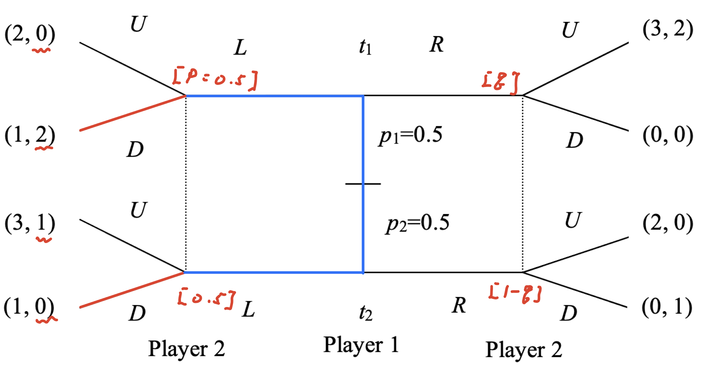

class: middle

```{r, child = '../setup.rmd', cache = FALSE}
```

```{r xaringan-scribble, echo=FALSE}
xaringanExtra::use_scribble()
```

```{r, include = F, cache = FALSE}
library(data.table)
library(ggplot2)
library(dplyr)
library(gganimate)
library(gifski)
library(gganimate)
# library(learnr)
```

```{r, include = F, eval=F, cache = FALSE}
httpgd::hgd()
httpgd::hgd_browse()
```

```{r xaringan-tachyons, echo=FALSE}
xaringanExtra::use_tachyons()
```


# Where are we?

```{r  echo = F, out.width = "100%"}
knitr::include_graphics("photos/game_types.png")
``` 


---
class: middle

# Overview: Signaling game

Players: a signal sender (e.g., employee) and a signal receiver (e.g., employer)

.bg-washed-green.b--dark-green.ba.bw2.br3.shadow-2.ph2.mt2[
**step 1** Pick a strategy for sender (seprarating or pooling stratgy). Assume it is sender's strategy at equilibirum. 
  + <span style="color:blue">We want to check whether this sender's strategy can be a part of PBE or not</span>

**step 2** What's the receiver's beliefs about sender's type that are consistent with the sender's strategy? Given that belief, what's the receiver's BR?

**step 3** Given the receiver's BR, what's the sender's BR? Is it consistent with what we assumed for this equilibrium? (or can you find any profitable deviation for player 1 that what we assumed in step 1?)

+ If it is consistent, it is a pure strategy PBE. 
+ If no, there is no pure strategy PBE as such.

**step 4** Check whether the PBE satisfy intuitive criteria (not for today. We'll learn this in the next lecture). 
]

Repeat step 1 ~ step 4 for all possible player 1's strategies. 


+ In step 3, 

---
class: middle

## "Practice makes perfect"

Let's do it!

???

+ "Practice makes perfect".
+ Maybe you guys don't understand what I am talking about, so let's paractice. 

+ Also, as you will see when you review the past final exam, the same type of the question is asked every year in Problem 1, and you don't want to spend lots of time in the first problem. 
+ So, let's practice how to solve signaling game. 

---

class: middle

# Spring 2023 Finall Problem 1

Consider the following signaling game shown in the figure below, where player 1 can be of two types and chooses to play $L$ or $R$. Player 2 initially does not know whether player 1 is of type $t1$ or type $t2$, only the initial probabilities. Player 2 observes the choice of L or R and may update probabilities of types based on the choice by player 1. Player 2 then chooses $U$ or $D$. 

```{r  echo = F, out.width = "60%"}

``` 

a.  Find all pure strategy perfect Bayesian equilibria for this game.

<br>

Problem 1 has three questions. Next week, we will work on questions (b) and (c). Question (b) is related to the intuitive criterion. 


---
class: middle

# Set up

I will use the following notations. 

```{r  echo = F, out.width = "60%"}

```

Define:

Player 2's belief: $p=Pr[t_1|L]$ and $q=Pr[t_1|R]$

Player 1's strategy: $(s_1^{t1}, s_1^{t2})$, Player 2's strategy: $(s_2^{L}, s_2^{R})$

???
+ I will use the following notations. $p$ and $q$ are the player 2's belief (in terms of probability) about player 1's type given player 1's signal. For example, $p$ is the player 2's belief that player 1 is type 1 after observing player 1 plays L. 


---
class: middle

step 0: Write out the possible strategies for player 1 (signal sender).


---
class: middle


step 0: Write out the set of strategies for  player 1 (signal sender).


Player 1's strategy: 

$$(s_1^{t_1}, s_1^{t_2}) \in \{\underbrace{(L, R), (R, L)}_\text{Separating strategies}, \underbrace{(L, L), (R, R)}_\text{Pooling strategies}\}$$


---
class: middle

## Case I: Separating Equilibrium $(s_1^{t_1}, s_1^{t_2})=(L, R)$

<b>Step 1:</b> Suppose that player 1 plays a separating strategy $(s_1^{t_1}, s_1^{t_2})=(L, R)$ at equilibrium. 

```{r  echo = F, out.width = "80%"}

``` 

 <b>Step 2:</b> What should player 2's beliefs be? What is the player 2's BR to Player 1's strategy?

Player 2's beliefs are $p=1$ and $q=0$. Given these beliefs, player 2's BR is $(s_2^{L}, s_2^{R})=(D, D)$.


???
+ Step 1, we assume that ...
+ The blue line shows the assumed player 1's strategy. 
+ Then in step2, given the separating sestrategy of player 1, we need to specifcy the player 2's beliefs, and his BR to player 1's strategy. 

+ What should player 2's belief be?
  + 

---
class: middle

## Case I: Separating Equilibrium $(s_1^{t_1}, s_1^{t_2})=(L, R)$

We found that player 2's BR is $(s_2^{L}, s_2^{R})=(D, D)$.

```{r  echo = F, out.width = "80%"}

``` 

---
class: middle

## Case I: Separating Equilibrium $(s_1^{t_1}, s_1^{t_2})=(L, R)$

```{r  echo = F, out.width = "60%"}

``` 

<b>Step 3:</b> Given player 2's BR, what is player 1's BR? Is it consistent with what we assumed for this equilibrium?

+ Player 1's BR is $(s_1^{t_1}, s_1^{t_2})=(L, L)$ (oops, type 2 would rather play $L$ than $R$!) 

**Conclusion**: There is no separating equilibrium as such. 

 

---
class: middle
## Case II: Separating Equilibrium $(s_1^{t_1}, s_1^{t_2})=(R, L)$

Let's practice. Find a pure strategy PBE for this case. 

```{r  echo = F, out.width = "70%"}

``` 


---

## Memo:


---

class: middle

## Case III: Pooling Equilibrium $(s_1^{t_1}, s_1^{t_2})=(L, L)$

<b>Step 1:</b> Suppose that player 1 plays a pooling strategy $(s_1^{t_1}, s_1^{t_2})=(L, L)$ at equilibrium. 

```{r  echo = F, out.width = "70%"}

```

<b>Step 2:</b> Player 2's beliefs are $p=0.5$ and $q \in [0,1]$. Given these beliefs, what is Player 2's BR to Player 1's strategy?

---
class: middle

## Case III: Pooling Equilibrium $(s_1^{t_1}, s_1^{t_2})=(L, L)$

```{r  echo = F, out.width = "70%"}

```

.content-box-green[If player 1 plays L]

\begin{align*}
\text{Player 2's expected payoffs} =
    \begin{cases}
0 \cdot 1/2 + 1 \cdot 1/2 = 1/2 &\quad \text{by playing U} \\
2 \cdot 1/2 + 0 \cdot 1/2 = 1 &\quad \text{by playing D}
  \end{cases}
\end{align*}

So, player 2's BR when player 1 plays L is $s_2^{L}=D$

---
class: middle

## Case III: Pooling Equilibrium $(s_1^{t_1}, s_1^{t_2})=(L, L)$

```{r  echo = F, out.width = "70%"}

```

.content-box-green[If player 1 plays R]

\begin{align*}
\text{Player 2's expected payoffs} =
    \begin{cases}
2 \cdot q + 0 \cdot (1-q) = 2q &\quad \text{by playing U} \\
0 \cdot q + 1 \cdot (1-q) = 1-q &\quad \text{by playing D}
  \end{cases}
\end{align*}

So, 

\begin{align*}
\text{Player 2's BR correspondence} =
    \begin{cases}
    U  \quad & \text{ if } \, q > 1/3 \\
    U \text{ or } D &\text{ if } \, q = 1/3 \\
    D &\text{ if } \, q < 1/3
  \end{cases}
\end{align*}

---
class: middle

## Case III: Pooling Equilibrium $(s_1^{t_1}, s_1^{t_2})=(L, L)$

```{r  echo = F, out.width = "80%"}

```

<b>Step 3:</b> Given Player 2's BR, what is Player 1's BR? Any profitable deviation from what we assumed?

+ For type 1, playing $L$ yields payoff of $1$. <span style="color:blue">But, type 1 can get higher payoff of 3 by playing $R$ (if player 2's belief is $q > 1/3$). Playing $L$ is type 1's BR if $q \leq 1/3$</span>

+ Similarly, for type 2, playing $L$ is the BR if $q \leq 1/3$.

**Conclusion**: Thus, PBE is  $\{L, L; D, D; p=0.5, q \leq 1/3 \}$

---
class: middle
## Case IV: Pooling Equilibrium $(s_1^{t_1}, s_1^{t_2})=(R, R)$

Let's practice. Find a pure strategy PBE for this case. 

```{r  echo = F, out.width = "70%"}

``` 


---

## Memo:


---


