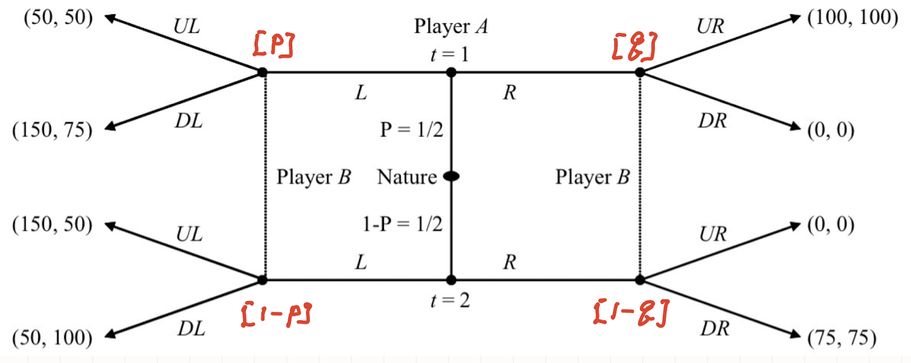
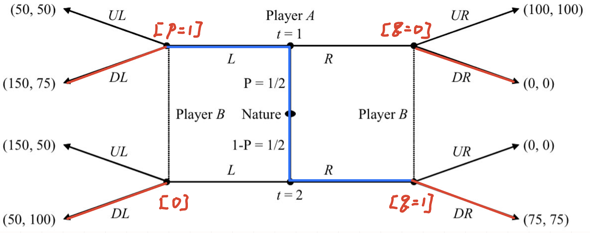
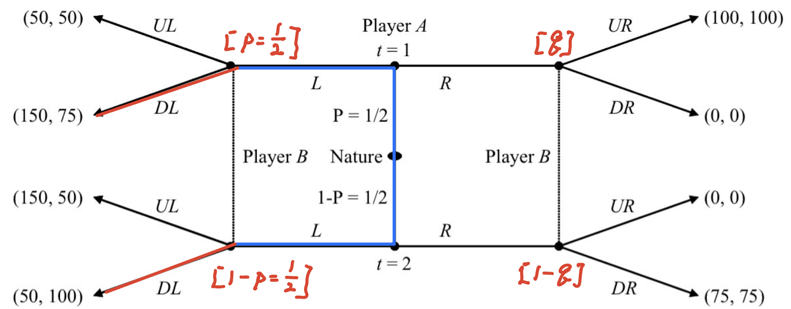
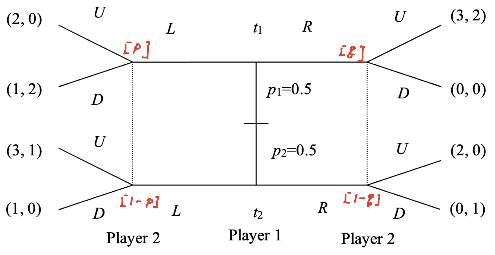

class: middle

```{r, child = '../setup.rmd', cache = FALSE}
```

```{r xaringan-scribble, echo=FALSE}
xaringanExtra::use_scribble()
```

```{r, include = F, cache = FALSE}
library(data.table)
library(ggplot2)
library(dplyr)
library(gganimate)
library(gifski)
library(gganimate)
# library(learnr)
```

```{r, include = F, eval=F, cache = FALSE}
httpgd::hgd()
httpgd::hgd_browse()
```

```{r xaringan-tachyons, echo=FALSE}
xaringanExtra::use_tachyons()
```


# For the Final Exam

**Static games of incomplete information**

+ Cournot duopoly with incomplete information about cost 
+ Cutoff strategies
  + 2017, 2022 Final
+ First prices sealed-bid auction with two bidders
+ Double auction
  + Single price equilibrium
  + Linear strategy equilibrium
    + 2017 Final

**Dynamic games of incomplete information**

+ Signaling game (discrete strategies)
  + Almost every year
+ Dynamic Cournot duopoly game 
  + Practice with Problem 1-e with Assignment 3, 2023 and 2022 Final 
+ Job market signaling game (continuous strategies)
  + 2020 and 2019 Final


---
class: middle

Suppose that player $i$ is a signal sender.

+ $a_i \in A_i$ is an action for player $i$
+ $t_i \in T_i$ denotes a type of player $i$

<br>

.bg-washed-green.b--dark-green.ba.bw2.br3.shadow-2.ph2.mt2[

**Intuitive Criterion**: If the information set following $a_i$ is off the equilibrium path and $a_i$ is equilibrium dominated for type $t_i$, then the Receiver's belief should place zero probability on type $t_i$ (i.e., $p(t_i|a_i)=0$) as long as $a_i$ is not equilibrium dominated for all types in $T$.
]


+ What's is 

---
class: middle

Suppose that player $i$ is a signal sender.

+ $a_i \in A_i$ is an action for player $i$
+ $t_i \in T_i$ denotes a type of player $i$

<br>

.bg-washed-green.b--dark-green.ba.bw2.br3.shadow-2.ph2.mt2[
**Intuitive Criterion**: If the information set following $a_i$ is off the equilibrium path and $a_i$ is equilibrium dominated for type $t_i$, then the Receiver's belief should place zero probability on type $t_i$ (i.e., $p(t_i|a_i)=0$) as long as $a_i$ is not equilibrium dominated for all types in $T$.
]

<br>

Two requirements to apply the Intuitive Criterion:

(1) The information set following $a_i$ is off the equilibrium path.

(2) $a_i$ is equilibrium dominated for type $t_i$ but not not all types. 


---
class: middle

Just to make sure ...

.content-box-green[**"off the equilibrium path"**]

> For a given equilibrium in a given extensive-form game, an information set is <b>on the equilibrium path</b> if it will be reached with positive probability if the game is played according to the equilibrium strategies, and <u> is <b>off the equilibrium path</b> if it is certain not to be reached if the game is played according to the equilibrium strategies</u>. `r tufte::quote_footer('--- Gibbsons P178')`

---
class: middle

## Example, Problem 4 in Assignment 4

<br>

```{r  echo = F, out.width = "70%"}

``` 

You found that PBE are 

(i) $\{(L, R), (DL, DR), p = 1, q = 0\}$

(ii) $\{(L, L), (DL, UR), p = 1/2, q= 3/7\}$

<br>

.content-box-green[**Question**]

Which of the PBE satisfy the Intuitive Criterion?

---
class: middle

.content-box-green[Case (i) Separating equilibrium {(L, R), (DL, DR), p = 1, q = 0}]

<br>

```{r  echo = F, out.width = "70%"}

``` 

<br>

There is no off the equilibrium path. 

&rarr; The Intuitive Criterion will not impose any restrictions on Player B (signal receiver)'s belief &rarr; The intuitive Criterion 


---
class: middle

.content-box-green[Case (ii) Pooling equilibrium {(L, L), (DL, UR), p = 1/2, q= 3/7}]

<br>

```{r  echo = F, out.width = "70%"}

``` 

1. Is there any off the equilibrium path? &rarr; Yes. The information set following $R$ is off the equilibrium path. 

2. Check whether $R$ is equilibrium dominated for type $t_i$ but not not all types. 

+ For type 1, $R$ is equilibrium dominated. 
+ For type 2, $R$ is not equilibrium dominated. 

<span style="color:blue">Intuitive Criterion activates! 
</span>

&rarr; Player B must believe $q=P[t_1|R]=0$ &rarr; contradiction (because the pooling equilibrium says that $q= 3/7$) &rarr; Case (ii) equilibrium does not satisfy the Intuitive Criterion. 


---
class: middle

# Exercise: Spring 2020 Final, Problem 1 (continued)

Consider the following signaling game shown in the figure below, where player 1 can be of two types and chooses to play $L$ or $R$. Player 2 initially does not know whether player 1 is of type $t1$ or type $t2$, only the initial probabilities. Player 2 observes the choice of L or R and may update probabilities of types based on the choice by player 1. Player 2 then chooses $U$ or $D$. 

```{r  echo = F, out.width = "60%"}

``` 

In the previous recitation, you found that the pure strategy PBE are (i) $\{R, L; U, U; p=0, q \leq 1 \}$, (ii) $\{L, L; D, D; p=0.5, q \leq 1/3 \}$, and (iii) $\{R, R; D, U; p \ge 1/3, q=0.5\}$.


<span style="color:blue">b. Which of the perfect Bayesian equilibria from part (a) satisfy the Intuitive Criterion? Justify your answer.</span>

---

## Notes:

---
class: middle

.bg-washed-green.b--dark-green.ba.bw2.br3.shadow-2.ph2.mt2[

**Incentive Compatibility Constraint**: 

An Equilibrium strategy must be a best response:

If the equilibrium strategy for $t=H$ is $e_H$, then 
$$w(e_H) - c(H, e_H) \ge w(e) - c(H, e) \quad \forall e \neq e_H$$

If the equilibrium strategy for $t=L$ is $e_L$, then 
$$w(e_L) - c(L, e_L) \ge w(e) - c(L, e) \quad \forall e \neq e_L$$

]

 This is the constraint to assure that there is no profitable deviation for each player from the equilibrium. 

???
+ Actually, we applied the incentive compatibility constraint to the signaling game we did. 
+ so, this is not a special thing. 
+ We use this to narrow down the potential equilibrium outcomes.


---
class: middle

## Spring 2019 Final, Problem 3 (continued)

Suppose there are two types of workers, high productivity types $(t = H)$ and low productivity types $(t = L)$.  A worker knows her type but a firm that is seeking to hire a worker does not. The probability of a worker being high productivity is $p_H  = 2/3$ and the probability of a low productivity type $p_L= 1/3$. A worker chooses an education level, $e \ge 0$, which is observable to firms.  The cost of education for a high type worker is: $c(H,e)=e^2$. The cost of education for a low type worker is: $c(L,e)=1.5e^2$. After observing the education level, firms offer wage contracts w(e) that specifies wages as a function of education. Assume that the output of a high type worker is: $y(H,e)=6+3e$ and the output of a low type worker is: $y(L,e)=6$.  The payoff for worker is: $w – c(t, e)$.  The payoff for a firm is: $y(t, e) - w$ .  Assume that firms are competitive so that they pay workers a wage equal to expected productivity: $w(e)=p(H│e)y(H,e)+p(L│e)y(L│e)$, where $p(x|e)$ is the conditional probability of the type $x$ ($x = H$ or $L$) given observed level of education $e$.

<span style="color:blue">Solve for efficient level of education, separating and pooling PBE, refine using Intuitive Criterion.</span>

<!-- ---
class: middle

.bg-washed-green.b--dark-green.ba.bw2.br3.shadow-2.ph2.mt2[
+ Two types of workers: $t=H$ with $p_H  = 2/3$;  $t=L$ with $p_L  = 1/3$
+ Cost of education: $c(H,e)=e^2; c(L,e)=1.5e^2$
+ Worker's productivity: $y(H,e)=6 + 3e$; $y(L,e)=6$
+ The payoff for a worker is $w - c(t,e) \quad \all t \in {H, L}$ 
+ The payoff for a firm is $y(t,e)-w$
+ Wage equation: $w(e)=p(H│e)y(H,e)+p(L│e)y(L,e)=p(H│e)(6 + 3e)+p(L│e)6$
] -->

<!-- ---
class: middle

## Pooling equilibrium: $(s_1^{H},s_1^{L})=(e_p, e_p)$

<b> Then, firm's beliefs </b>: 

+ $P(H|e_p)=2/3$.
+ $P(H|e \neq e_p)$ is off the equilibrium path, so it can be anything. Assume $P(H|e \neq e_p)=0$ so that choice of $e \neq e_p$ is unattractive. 

<b> Given these beliefs, what is the firm's BR? </b>

According to the wage equation,
\begin{align*}
  \begin{cases}
  \text{If observing } e=e_p \text{, pay} \, w(e_p)=6 +2e_p \\
  \text{If observing } e \neq e_p \text{, pay} \, w(e\neq e_p)=6
  \end{cases}
\end{align*}

---
class: middle

<b> Given the firm's BR, what is the worker's BR? (use Incentive Compatibility Constraint)</b>

First, if the worker plays $e \neq e_p$, which $e$ would a rational worker choose? &rarr $e=0$

For type $H$, it must be that 
\begin{align*}
&\quad \text{payoff from playing} e=e_p \ge \text{payoff from playing} e \neq e_p \\
\iff&\quad w(e_p) - c(H,e_p) \ge w(e \neq e_p) - c(H, 0) \\
\iff&\quad 6 +2e_p - e_p^2 \ge 6 - 0 \\
\iff&\quad e_p \leq 2  
\end{align*}


For type $L$, it must be that 
\begin{align*}
&\quad \text{payoff from playing} e=e_p \ge \text{payoff from playing} e \neq e_p \\
\iff&\quad w(e_p) - c(L,e_p) \ge w(e \neq e_p) - c(L, 0) \\
\iff&\quad 6 +2e_p - 1.5e_p^2 \ge 6 - 0 \\
\iff&\quad e_p \leq 4/3
\end{align*}

<b>Conclusion</b>: Pooling PBE is $\{e_p \in [0, 4/3];  w(e_p)=6 +2e_p, w(e\neq e_p)=6; P(H|e_p)=2/3, P(H|e \neq e_p)=0\}$.
 -->


<!-- % $$\begin{align*}
% w(e) &= p(H│e)y(H,e)+ P(L|e \neq e_p) y(L, e) \\
%   &= \begin{cases}
%       2/3 \cdot (6 + 3 e_P) + 1/3 \cdot 6  = 6 +2e_P \text{if $e=e_H$} \\
%       0 \cdot (6 + 3e) + 1 \cdot 6 = 6 &\quad \text{if e \neq e_H}
%   \end{cases}
% \end{align*}$$
 -->


