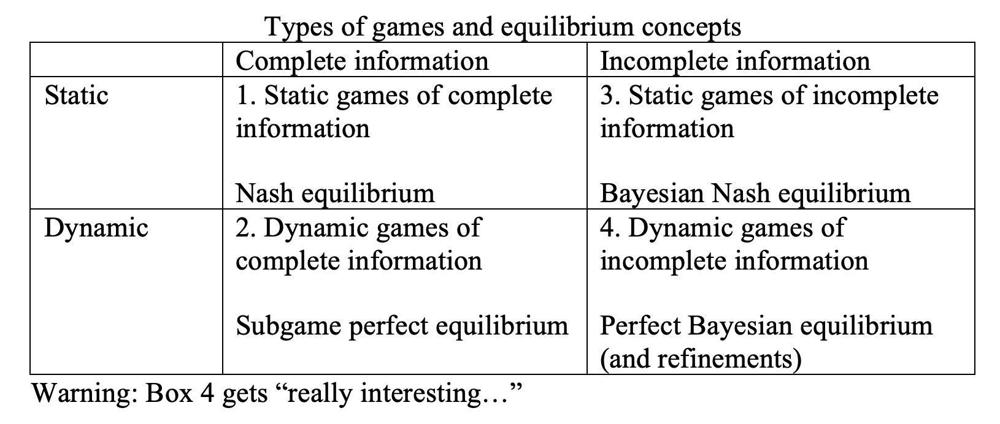
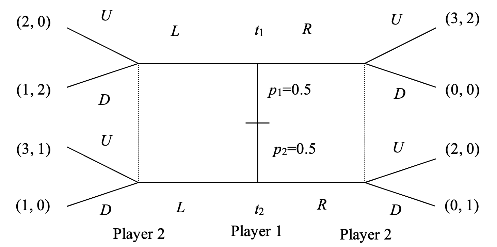
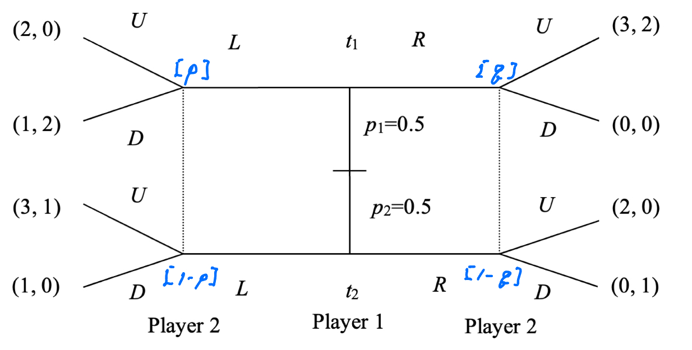
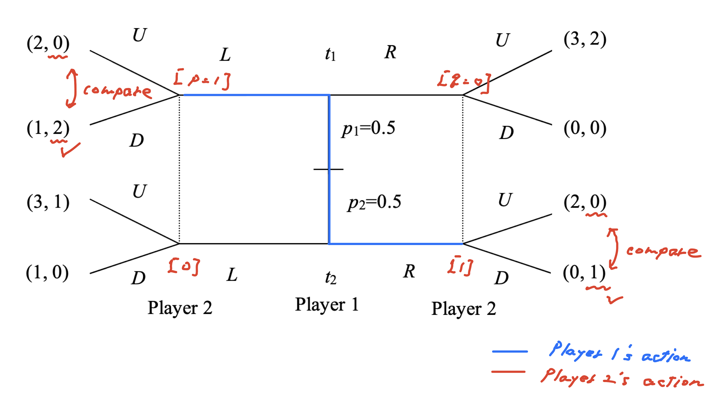
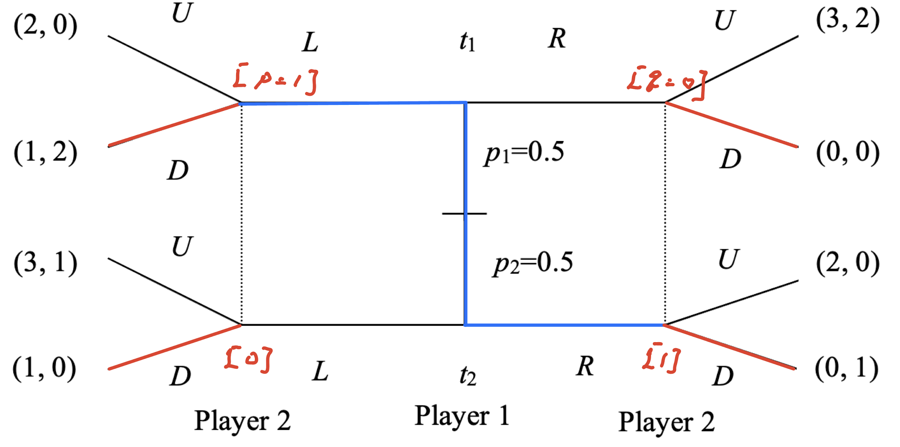
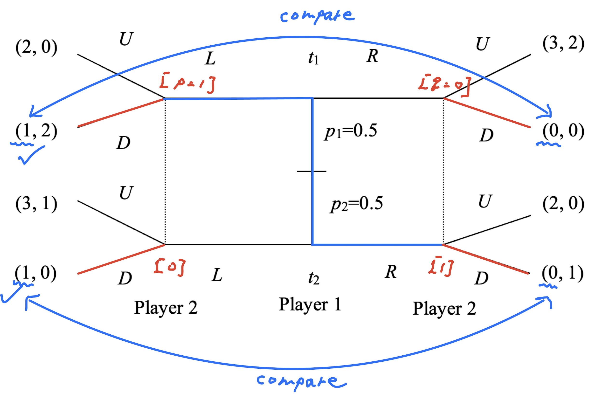
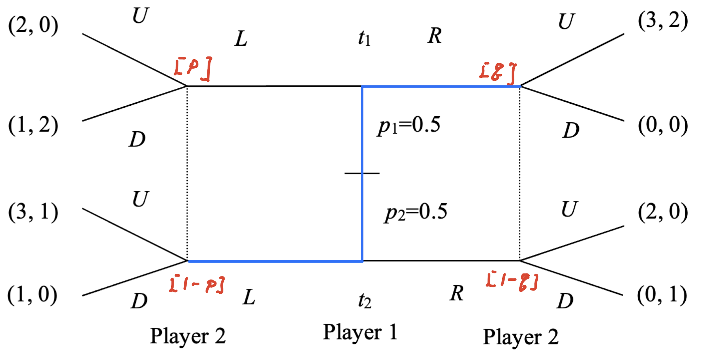

class: middle

```{r, child = '../setup.rmd', cache = FALSE}
```

```{r xaringan-scribble, echo=FALSE}
xaringanExtra::use_scribble()
```

```{r, include = F, cache = FALSE}
library(data.table)
library(ggplot2)
library(dplyr)
library(gganimate)
library(gifski)
library(gganimate)
# library(learnr)
```

```{r, include = F, eval=F, cache = FALSE}
httpgd::hgd()
httpgd::hgd_browse()
```

```{r xaringan-tachyons, echo=FALSE}
xaringanExtra::use_tachyons()
```


# Outline

---
class: middle

# Static games of Incomelete Information

.bg-washed-green.b--dark-green.ba.bw2.br3.shadow-2.ph2.mt2[ 
<b>Baysian Nash Equilibrium</b>

Definition: .
]

???
+ The core idea is the same as NE in the perfect competition. That is, each players plays their best responses to the other players strategies.
+ The only complecation is that now, we need to maximize the 

---
class: middle

# Static games of Incomelete Information

## List of topics

+ Cournot Duopoly with asymmetric information about Cost
+ Provision of a Public Goods (free-rider problem)
    + cut-off strategy
+ First price sealed-bid auction with two bidders
+ Double auction
    + Sigle price equilibirium
    + Linear strategy equilibrium

---
class: middle

# Dynamic game of incomplete information

.bg-washed-green.b--dark-green.ba.bw2.br3.shadow-2.ph2.mt2[ 
<b>Pure strategy perfect Bayesian equilibria (PBE)</b>

Definition: A set of strategies is a subgame Nash equilibrium if it is a Nash equilibirium in all subgames.

is a strategy combination $S=(s_1, s_2, ..., s_n)$ and a set of believes $p$ such that at every information set

(i) $i \in N$ the strategy for the 


]

+ pure strategy PBE
+ 


???
+ Okay, 

---
class: middle

# Where are we?

```{r  echo = F, out.width = "100%"}

``` 

Perfect Bayesian NE is a refinement of 

---
class: middle

# Overview: Signaling game

Players: a signal sender (e.g., employee) and a signal receiver (e.g., employer)

.bg-washed-green.b--dark-green.ba.bw2.br3.shadow-2.ph2.mt2[
**step 1** Assume the sender's strategy at equilibrium (i.e., separating or pooling equilibrium).

**step 2** What's the receiver's beliefs about sender's type that are consistent with sender's strategy. Given that belief, what's the receiver's BR?

**step 3** Given the receiver's BR, what's the sender's BR? Is it consistent with what we assumed for this equilibrium? (or can you find any profitable deviation for player 1 that what we assumed in step 1?)

+ If it is consistent, it is a pure strategy PBE. 
+ If no, there is no pure strategy PBE as such.

**step 4** Check whether the PBE satisfies the intuitive criteria (not for today. We'll learn this in the next lecture). 
]

Repeat step 1 ~ step 4 for all possible player 1's strategies. 

???
+ Well, as usual, to understand how to solve this kind of complicated problem, I think the best way is to understanding the mechanism or logic by solving the problem.
+ As you will see when you review the past final exam, the same type of the question is asked every year in Problem 1, and you don't want to spend lots of time in the first problem. 
+ So, let's practice how to 

---

class: middle

# Spring 2023 Finall Problem 1

Consider the following signaling game shown in the figure below, where player 1 can be of two types and chooses to play $L$ or $R$. Player 2 initially does not know whether player 1 is of type $t1$ or type $t2$, only the initial probabilities. Player 2 observes the choice of L or R and may update probabilities of types based on the choice by player 1. Player 2 then chooses $U$ or $D$. 

```{r  echo = F, out.width = "60%"}

``` 

a.  Find all pure strategy perfect Bayesian equilibria for this game.

<br>

Problem 1 has three questions. Next week, we will work on questions (b) and (c). Question (b) is related to the intuitive criterion. 

???
+ Let me work through how to solve this problem. 
+ There four possible pure strategy NE, two for pooling equilibrium and two for separating equilibrium. 
+ To let I am going to explain one pooling equilibrium and one separating equilibrium. 

---
class: middle

# Set up

I will use the following notations. 

```{r  echo = F, out.width = "60%"}

```

Define:

Player 2's belief: $p=Pr[t_1|L]$ and $q=Pr[t_1|R]$

Player 1's strategy: $(s_1^{t1}, s_1^{t2})$, Player 2's strategy: $(s_2^{L}, s_2^{R})$

Player 1's payoff: $(u_1^{t1}, u_1^{t2})$

???
+ I will use the following notations. $p$ and $q$ are the player 2's belief (in terms of probability) about player 1's type given player 1's signal. For example, $p$ is the player 2's belief that player 1 is type 1 after observing player 1 plays L. 

---
class: middle

step 0: Write out the possible strategies for player 1 (signal sender).


---
class: middle


step 0: Write out the player 1 (signal sender)'s possible strategies.


Player 1's strategy: 

$$(s_1^{t_1}, s_1^{t_2}) = \{\underbrace{(L, R), (R, L)}_\text{Separating strategies}, \underbrace{(L, L), (R, R)}_\text{Pooling strategies}\}$$

---
class: middle

## Case I: Separating Equilibrium $(s_1^{t_1}, s_1^{t_2})=(L, R)$

```{r  echo = F, out.width = "80%"}

``` 

Suppose that player 1 plays a separating strategy $(s_1^{t_1}, s_1^{t_2})=(L, R)$ at equilibrium. 

<b>(step 1)</b> What should player 2's beliefs be? What is the player 2's BR?

Player 2's beliefs are $p=1$ and $q=0$. Given these briefs, player 2's BR is $(s_2^{L}, s_2^{R})=(D, D)$.


???
+ Let's consider that Suppose that player 1 plays a separating strategy $(L, R)$. What the player 2's belief should be?

---
class: middle

## Case I: Separating Equilibrium $(s_1^{t_1}, s_1^{t_2})=(L, R)$

We found that player 2's BR is $(s_2^{L}, s_2^{R})=(D, D)$.

```{r  echo = F, out.width = "80%"}

``` 

---
class: middle

## Case I: Separating Equilibrium $(s_1^{t_1}, s_1^{t_2})=(L, R)$

```{r  echo = F, out.width = "60%"}

``` 

<b>(step 2)</b> Given player 2's BR, what is player 1's BR? Is it consistent with what we assumed for this equilibrium?

+ Player 1's BR is $(s_1^{t_1}, s_1^{t_2})=(L, L)$ (oops, Player 1 with type 2 would rather play $L$ than $R$!) 

&rarr; Conclusion: There is no separating equilibrium as such. 

???
+ The next question is what is player 1's BR given player 2's BR. 
+ For player 1 with type 1, we compare player 1's payoff of 1 by playing L, and payoff of 0 obtained by playing R. Obviously, 

---
class: middle
## Case II: Separating Equilibrium $(s_1^{t_1}, s_1^{t_2})=(R, L)$

Let's practice. Find a pure strategy PBE for this case. 

```{r  echo = F, out.width = "70%"}

``` 

???
+ You should get $\{R,L; U, U; p=0, q=1\}$

---

## Memo:


---

class: middle

## Case III: Pooling Equilibrium $(s_1^{t_1}, s_1^{t_2})=(L, L)$


